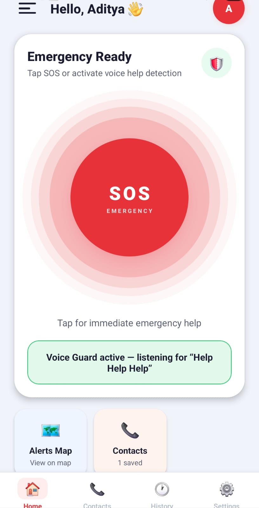
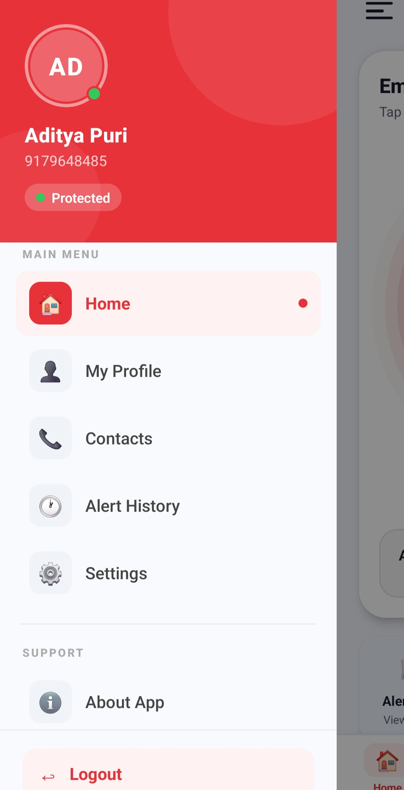
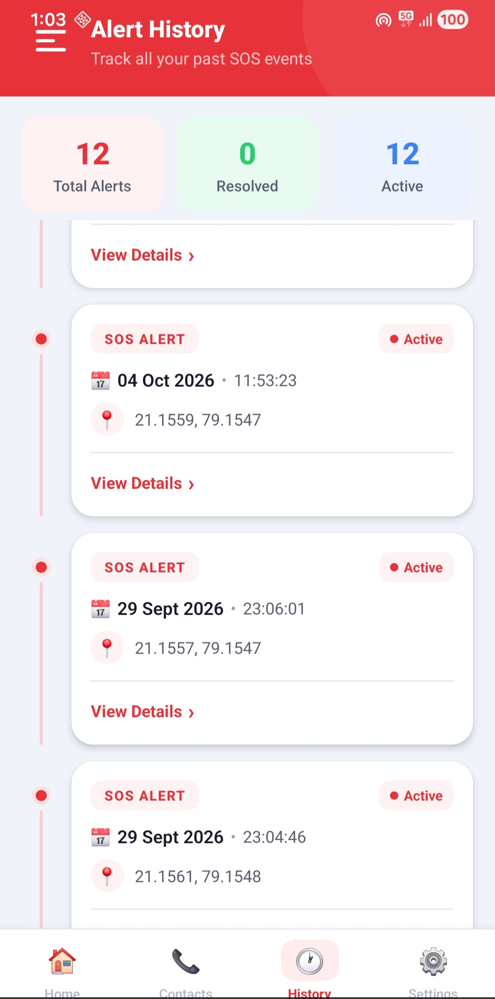

# 🚨 Smart SOS App

A real-time emergency assistance mobile application built with React Native and Node.js.

The application allows users to trigger emergency alerts, share their location, manage emergency contacts, and activate SOS functionality using voice commands.


## ✨ Features

- 🔐 User authentication
- 🚨 Emergency SOS alert
- 🎙️ Voice-based SOS activation
- 📍 Location sharing
- 👥 Emergency contact management
- ⚡ Real-time communication
- 🔔 Emergency notifications
- 🔒 JWT-based authentication

## ✨ Features

- 🔐 User authentication
- 🚨 Emergency SOS alert
- 🎙️ Voice-based SOS activation
- 📍 Location sharing
- 👥 Emergency contact management
- ⚡ Real-time communication
- 🔔 Emergency notifications
- 🔒 JWT-based authentication

- ## 📱 Screenshots
- ## 📱 Screenshots

### 🔐 Login


### 🏠 Home



### 🚨 Profile



### 🎙️ History



### 🔔 Settings


## 🛠️ Tech Stack

### Frontend
- React Native
- JavaScript / TypeScript
- React Native CLI
- AsyncStorage
- Geolocation

### Backend
- Node.js
- Express.js
- MongoDB
- Socket.IO
- JWT
- Twilio

### Database
- MongoDB Atlas

### Deployment
- Render

- ## 🏗️ Architecture

```text
        React Native App
               |
               | REST API
               ▼
        Express.js Backend
               |
        ┌──────┴──────┐
        ▼             ▼
   MongoDB Atlas   Socket.IO
        |             |
        └──────┬──────┘
               ▼
            Twilio
        Emergency Alerts


```markdown
## 📂 Project Structure

```text
Smart-SOS-App/
│
├── SOSApp/
│   ├── android/
│   ├── src/
│   ├── package.json
│   └── ...
│
├── Backend-SOS/
│   ├── src/
│   ├── package.json
│   └── ...
│
├── screenshots/
│   ├── login.png
│   ├── home.png
│   ├── sos.png
│   └── ...
│
└── README.md


---


```markdown
## 🚨 How It Works

1. User logs into the application.
2. User triggers an SOS using the emergency button or voice command.
3. The application obtains the user's location.
4. The emergency information is sent to the backend.
5. The backend processes the SOS request.
6. Real-time communication is handled using Socket.IO.
7. Emergency notifications are sent to the configured contacts.

## 🚀 Installation

### 1. Clone the repository

```bash
git clone https://github.com/Adityapuri18/Smart-SOS-App.git

cd Smart-SOS-App

cd Backend-SOS
npm install
npm start

**Do not put your real credentials in GitHub.**

Add:

```markdown
## 🔐 Environment Variables

Create a `.env` file in the backend and configure the required environment variables.

Example:

```env
MONGODB_URI=your_mongodb_connection_string
JWT_SECRET=your_jwt_secret
TWILIO_ACCOUNT_SID=your_twilio_account_sid
TWILIO_AUTH_TOKEN=your_twilio_auth_token

This is optional but looks good:

```markdown
## 🔮 Future Improvements

- Background SOS monitoring
- Improved emergency contact management
- Push notifications
- Enhanced location tracking
- Emergency response integration
